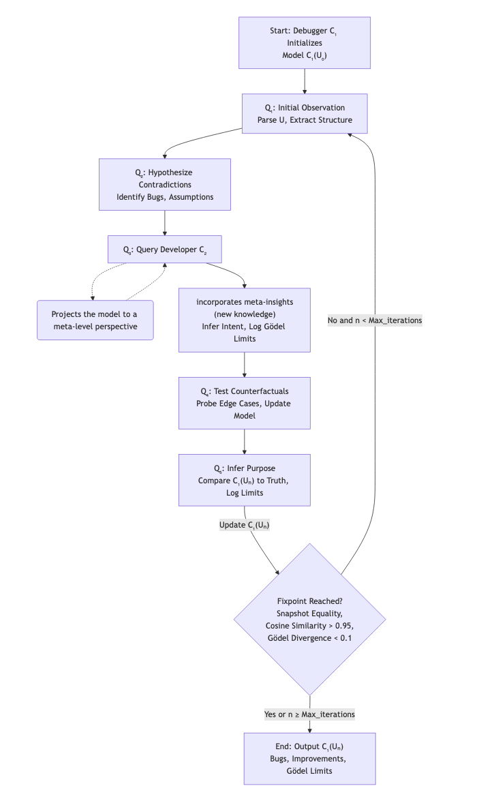

# Summary of the Debugger Design

## Core Model Loop (from our paper)

Let:

- **$U$** = codebase (universe), representing the function or system being debugged (e.g., `process_advanced_payment`).
- **$C_1$** = conscious debugger, an LLM-driven agent that iteratively models $U$.
- **$C_2$** = developer LLM, simulating developer $C_2 \dashrightarrow M$ input to refine the model.
- **$Q_n$** = recursive query sequence, comprising observation, hypothesis generation, developer queries, counterfactual testing, and purpose inference.
- **$C_1(U_n)$** = $C$'s internal model of $U$ after n iterations, capturing inferred structure, bugs, assumptions, and improvements.
- **Fixpoint** = state where $C_1(U_n) \approx U$ within Gödelian incompleteness tolerance, meaning the model stabilizes (no new hypotheses, low divergence from inferred purpose, or snapshot equality).

The debugger operates in a Gödelian environment, where external ground truth is unavailable. Instead, $C_1$ infers the function's purpose from code, developer insights, and its own hypotheses, treating this as the internal "truth" for consistency checks.

## Expanded Agent Loop

The debugger follows a recursive loop with five distinct steps, iterating until a fixpoint is reached:

### $Q_1$ – Initial Observation

Analyzes the codebase ($U$) to extract structural patterns, inputs, outputs, and assumptions. Uses `PythonFunctionLoader` to parse code and metadata. Identifies initial invariants and potential gaps.

### $Q_2$ – Hypothesize Contradictions and Gaps

Generates hypotheses about inconsistencies, bugs, or unknowns ("*What doesn’t make sense?*"). For example, detects hardcoded exchange rates or late fraud checks in `process_advanced_payment`. Hypotheses are refined into structured model updates (bugs, assumptions).

### $Q_3$ – Query Developer for Intent

Consults a developer LLM ($C_2$) to infer higher-order intent, rules, or meta-principles. Captures insights about purpose and limitations without real knowledge of $M$ but making assumptions. Unresolvable intent questions are logged as Gödelian limits.

### $Q_4$ – Test Counterfactuals

Probes the system with adversarial or edge-case scenarios (e.g., unsupported currencies, negative amounts, non-boolean fraud flags). Reveals hidden assumptions or logical errors, such as missing recipient validation in transfers.

### $Q_5$ – Infer Purpose and Compare

Synthesizes the function's purpose from code structure, developer insights, and hypothesized model, treating it as the internal truth. Compares the current model $C_1(U_n)$ to this inferred purpose to identify discrepancies (e.g., missing audit log append mode). Ambiguities in purpose are recorded as Gödelian limits.

### $Q_n$ – Repeat Until Fixpoint

Iterates until $C_1(U_n) \approx U$ determined by:

- Snapshot equality (model state unchanged).
- Hypothesis convergence (new hypotheses similar to previous, via embedding-based cosine similarity > 0.95).
- Low Gödel divergence (< 0.1), comparing the model to the inferred purpose and code structure.

Halts after a maximum number of steps (default 5) or minimum steps (default 2) if fixpoint is reached.

## Main Components of the Debugger

### Persistent Model State $C_1(U_n)$

A structured representation within `WorldModel`, storing:

- Functions (e.g., `process_advanced_payment`), with inputs, returns, bugs, assumptions, and improvements.
- Global invariants, contradictions, hypotheses, developer insights, counterfactuals, and inferred purposes.
- Gödel limits (unanswerable questions, e.g., "*Why is user_id 42 blocked?*").

Updated iteratively via `refine_model` based on $Q_1-Q_5$ outputs.

### Recursive Controller

Implemented in `ConsciousDebugger.recursive_debug`, orchestrates the Qₙ loop. Manages step execution, model updates, and fixpoint checks. Caps iterations to prevent infinite loops and logs progress for debugging.

### Gödel-Aware Monitor

Tracks questions C cannot answer within $U$ (ambiguous intent, external dependencies). Integrated into `WorldModel`:

- Logs Gödel limits during developer queries and purpose inference (e.g., “Unable to infer refund validation intent”).
- Quantifies uncertainty in `compute_godel_divergence`, factoring in structural, semantic, and insight-based discrepancies, plus Gödel limit weight.

### Debugging Interface ($C_1$)

Visualizes the debugging process via:

- Console output in `visualize_debug_state`, showing model state, Gödel limits, observations, hypotheses, counterfactuals, developer insights, and inferred purpose after each step.
- `ModelPresenter`, which displays bugs and improvements as styled tables in Jupyter notebooks. Merges semantically similar bugs (e.g., fraud check timing issues) using embedding-based clustering (cosine similarity > 0.9), ensuring concise output.

### Developer LLM ($C_2$)

Simulates internal developer input that without any knowledge of $M$ is trying to reach to to $M$ to provide meta-insights on intent, assumptions, and limitations. Queried in $Q_3$ to refine the model via $C_1(U_n)\xrightarrow{\;Q_3\;} C_2(M) \xrightarrow{\;K\;} C_1(U_{n+1})$, where $Q_3$​ projects the model to a meta-level perspective in $C_2$​, and $K$ incorporates meta-insights (new knowledge) back into $C_1$​​. Responses shape purpose inference and are logged as meta_insights, with ambiguities marked as Gödel limits.

## Key Features

- **Gödelian Adaptation**: Operates without external truth, inferring purpose as the internal reference for model comparison, aligning with Gödelian constraints where $U$ is self-contained.
- **Semantic Bug Consolidation**: `ModelPresenter` uses embeddings to merge duplicate bugs (e.g., multiple wordings of audit log overwriting), improving clarity.
- **Robust Numerical Stability**: Embedding comparisons (`safe_cosine_similarity`, `get_embedding`) handle zero vectors and invalid inputs, avoiding numerical warnings (e.g., sklearn issues from earlier iterations).
- **Counterfactual Testing**: $Q_4$ probes edge cases (e.g., invalid currencies, case-sensitive tiers), exposing hidden bugs and assumptions.
- **Fixpoint Detection**: Combines snapshot equality, hypothesis similarity, and Gödel divergence to determine when $C_1(U_n) \approx U$, balancing completeness and efficiency.
